# Kubiya CLI 🤖

[](LICENSE)
[](https://golang.org)
[](https://python.org)

> Command-line interface for managing AI agents and automating workflows with Kubiya

## 📋 Table of Contents

- [Installation](#-installation)
- [Authentication](#-authentication)
- [Quick Start](#-quick-start)
- [Commands](#-commands)
  - [Agent Management](#agent-management)
  - [Team Management](#team-management)
  - [Execution Management](#execution-management)
  - [Job Management](#job-management)
  - [Skill Management](#skill-management)
  - [Model Management](#model-management)
  - [Policy Management](#policy-management)
  - [Environment Management](#environment-management)
  - [Project Management](#project-management)
  - [Operator Management](#operator-management)
  - [Worker Management](#worker-management)
  - [Context Graph](#context-graph)
- [Running Workers](#-running-workers)
- [Configuration](#-configuration)
- [Contributing](#-contributing)

## 🚀 Installation

### Quick Install (One-Liner) - Recommended

The easiest way to get started on **macOS and Linux**:

```bash
# Basic installation
curl -fsSL https://raw.githubusercontent.com/kubiyabot/cli/main/install.sh | bash

# Install + configure worker in one command
curl -fsSL https://raw.githubusercontent.com/kubiyabot/cli/main/install.sh | bash -s -- --worker --queue-id=my-queue

# Install + start worker in daemon mode (production)
curl -fsSL https://raw.githubusercontent.com/kubiyabot/cli/main/install.sh | bash -s -- --worker --queue-id=prod-queue --mode=daemon --start

# Interactive configuration
curl -fsSL https://raw.githubusercontent.com/kubiyabot/cli/main/install.sh | bash -s -- --config
```

**Install Script Options:**
- `-w, --worker` - Setup worker after installation
- `-q, --queue-id <id>` - Worker queue ID (required with --worker)
- `-m, --mode <mode>` - Worker mode: local, docker, daemon (default: local)
- `-s, --start` - Start worker immediately after setup
- `-c, --config` - Interactive configuration setup
- `-f, --force-binary` - Force binary installation (skip package managers)
- `-v, --verbose` - Enable verbose output
- `-h, --help` - Show help message

### macOS (Homebrew)

```bash
brew update
brew tap kubiyabot/kubiya
brew install kubiya

# Verify installation
kubiya version
```

### Linux

#### Option 1: Automated Script (Recommended)
```bash
curl -fsSL https://raw.githubusercontent.com/kubiyabot/cli/main/install.sh | bash
```

The script automatically detects your Linux distribution and installs using:
- **Debian/Ubuntu**: APT package manager
- **RHEL/CentOS/Fedora**: YUM/DNF package manager
- **Other**: Direct binary installation

#### Option 2: Direct Binary Download

```bash
# Download latest release for your architecture
VERSION=$(curl -s https://api.github.com/repos/kubiyabot/cli/releases/latest | grep tag_name | cut -d '"' -f 4)
ARCH=$(uname -m | sed 's/x86_64/amd64/g' | sed 's/aarch64/arm64/g')

curl -LO "https://github.com/kubiyabot/cli/releases/download/${VERSION}/kubiya-cli-linux-${ARCH}"
chmod +x kubiya-cli-linux-${ARCH}
sudo mv kubiya-cli-linux-${ARCH} /usr/local/bin/kubiya

# Verify installation
kubiya version
```

#### Option 3: Specific Version

```bash
VERSION=v2.5.5
ARCH=$(uname -m | sed 's/x86_64/amd64/g' | sed 's/aarch64/arm64/g')
curl -LO "https://github.com/kubiyabot/cli/releases/download/${VERSION}/kubiya-cli-linux-${ARCH}"
chmod +x kubiya-cli-linux-${ARCH}
sudo mv kubiya-cli-linux-${ARCH} /usr/local/bin/kubiya
```

### Windows

Download the latest Windows binary from [GitHub Releases](https://github.com/kubiyabot/cli/releases):

```powershell
# Using PowerShell
$VERSION = (Invoke-WebRequest -Uri "https://api.github.com/repos/kubiyabot/cli/releases/latest" | ConvertFrom-Json).tag_name
$URL = "https://github.com/kubiyabot/cli/releases/download/$VERSION/kubiya-cli-windows-amd64.exe"
Invoke-WebRequest -Uri $URL -OutFile "kubiya.exe"

# Move to a directory in your PATH
Move-Item kubiya.exe C:\Windows\System32\kubiya.exe

# Verify installation
kubiya version
```

Or download manually: https://github.com/kubiyabot/cli/releases

### Docker

Run the CLI in a Docker container:

```bash
# Pull the latest image
docker pull kubiyabot/cli:latest

# Run CLI commands
docker run --rm -e KUBIYA_API_KEY="your-api-key" kubiyabot/cli:latest version

# Interactive mode
docker run -it --rm -e KUBIYA_API_KEY="your-api-key" kubiyabot/cli:latest

# Run with volume mount for persistent config
docker run -it --rm \
  -e KUBIYA_API_KEY="your-api-key" \
  -v ~/.kubiya:/root/.kubiya \
  kubiyabot/cli:latest
```

### Go Install

If you have Go 1.21+ installed:

```bash
go install github.com/kubiyabot/cli@latest

# Verify installation
kubiya version
```

### Build from Source

```bash
# Clone the repository
git clone https://github.com/kubiyabot/cli.git
cd cli

# Build
make build

# Install locally
make install

# Verify installation
kubiya version
```

### Verify Installation

After installation, verify the CLI is working:

```bash
kubiya version
kubiya --help
```

📖 **Full Installation Guide**: https://docs.kubiya.ai/installation
📦 **GitHub Releases**: https://github.com/kubiyabot/cli/releases

## 🔐 Authentication

### Interactive Login (Recommended)

```bash
kubiya login
```

### API Key

```bash
export KUBIYA_API_KEY="your-api-key"
```

🔑 **Get your API key**: https://compose.kubiya.ai/settings#apiKeys

### Configuration Management

```bash
# List available contexts
kubiya config list

# Switch context
kubiya config use <context-name>

# Show current context
kubiya config current
```

📖 **Configuration Guide**: https://docs.kubiya.ai/cli/configuration

## ⚡ Quick Start

### Option 1: Execute with On-Demand Worker (Easiest)

Run AI tasks without needing a queue in advance - perfect for CI/CD pipelines!

```bash
# Set your API key
export KUBIYA_API_KEY="your-api-key"

# Execute task - no queue needed!
kubiya exec "Deploy my application to production"

# Execute with specific agent
kubiya agent exec <agent-id> "Run integration tests"

# Execute with a team
kubiya team exec <team-id> "Analyze security vulnerabilities"
```

**How it works:** The Control Plane creates an ephemeral worker queue for your execution, provisions a worker on managed infrastructure, runs your task, and automatically cleans up. **No queue setup or infrastructure management needed!** This makes it perfect for integrations inside CI/CD pipelines.

### Option 2: Execute with Persistent Worker

For high-frequency tasks or custom compute environments, run a persistent worker on **any infrastructure you choose**:

```bash
# Start worker in one command
kubiya worker start --queue <queue-id>

# Or install + start in one line
curl -fsSL https://raw.githubusercontent.com/kubiyabot/cli/main/install.sh | bash -s -- \
  --worker --queue-id=my-queue --start

# Then execute tasks
kubiya agent exec <agent-id> "Run daily backup" --queue <queue-id>
```

**Workers can run on nearly any compute environment:**
- 💻 **Your local machine** (Mac, Linux, Windows)
- ☸️ **Kubernetes clusters** (EKS, GKE, AKS, self-hosted)
- 🐳 **Docker containers**
- ☁️ **Virtual machines** (EC2, GCE, Azure VMs, etc.)
- 🖥️ **Bare metal servers**

This flexibility makes workers incredibly powerful and easy to deploy wherever your infrastructure lives!

### List Your Resources

```bash
# List agents
kubiya agent list

# List teams
kubiya team list

# List recent executions
kubiya execution list

# List scheduled jobs
kubiya job list
```

📖 **Getting Started Guide**: https://docs.kubiya.ai/getting-started
📖 **Worker Setup Guide**: https://docs.kubiya.ai/workers

## 📚 Commands

### Agent Management

Manage AI agents that execute tasks.

#### List Agents

```bash
kubiya agent list
kubiya agent list --output json
kubiya agent list --output yaml
```

#### Get Agent Details

```bash
kubiya agent get <agent-id>
kubiya agent get <agent-id> --output json
```

#### Create Agent

```bash
kubiya agent create --file agent.yaml
kubiya agent create --interactive
```

Example agent YAML:
```yaml
name: deployment-agent
description: Handles production deployments
model: gpt-4
skills:
  - kubernetes
  - helm
  - monitoring
environment_id: prod-env
```

#### Update Agent

```bash
kubiya agent update <agent-id> --file agent.yaml
```

#### Delete Agent

```bash
kubiya agent delete <agent-id>
kubiya agent delete <agent-id> --force
```

#### Execute with Agent

```bash
kubiya agent exec <agent-id> "Deploy to staging"
kubiya agent exec <agent-id> "Deploy to staging" --stream
```

### Team Management

Manage teams of agents that collaborate on tasks.

#### List Teams

```bash
kubiya team list
```

#### Get Team Details

```bash
kubiya team get <team-id>
```

#### Create Team

```bash
kubiya team create --file team.yaml
```

Example team YAML:
```yaml
name: devops-team
description: DevOps automation team
members:
  - agent-id-1
  - agent-id-2
  - agent-id-3
```

#### Update Team

```bash
kubiya team update <team-id> --file team.yaml
```

#### Delete Team

```bash
kubiya team delete <team-id>
```

#### Execute with Team

```bash
kubiya team exec <team-id> "Complete production deployment"
```

### Execution Management

Monitor and manage task executions.

#### List Executions

```bash
kubiya execution list
kubiya execution list --agent <agent-id>
kubiya execution list --status running
kubiya execution list --status completed
kubiya execution list --status failed
```

#### Get Execution Details

```bash
kubiya execution get <execution-id>
```

#### View Execution Logs

```bash
kubiya execution logs <execution-id>
kubiya execution logs <execution-id> --follow
```

#### Check Execution Status

```bash
kubiya execution status <execution-id>
```

#### Cancel Execution

```bash
kubiya execution cancel <execution-id>
```

### Job Management

Schedule and manage recurring tasks.

#### List Jobs

```bash
kubiya job list
```

#### Get Job Details

```bash
kubiya job get <job-id>
```

#### Create Job

```bash
kubiya job create --file job.yaml
```

Example job YAML:
```yaml
name: daily-backup
description: Run daily database backup
schedule: "0 0 * * *"  # Daily at midnight
agent_id: backup-agent
prompt: "Run full database backup"
enabled: true
```

#### Update Job

```bash
kubiya job update <job-id> --file job.yaml
```

#### Pause Job

```bash
kubiya job pause <job-id>
```

#### Resume Job

```bash
kubiya job resume <job-id>
```

#### Trigger Job Manually

```bash
kubiya job trigger <job-id>
```

#### Delete Job

```bash
kubiya job delete <job-id>
```

### Skill Management

Manage agent capabilities and skills.

#### List Skills

```bash
kubiya skill list
```

#### Get Skill Details

```bash
kubiya skill get <skill-id>
```

#### Create Skill

```bash
kubiya skill create --file skill.yaml
```

Example skill YAML:
```yaml
name: kubernetes
description: Kubernetes cluster management
type: cli
commands:
  - kubectl
  - helm
```

#### Update Skill

```bash
kubiya skill update <skill-id> --file skill.yaml
```

#### Delete Skill

```bash
kubiya skill delete <skill-id>
```

#### Validate Skill

```bash
kubiya skill validate skill.yaml
```

### Model Management

Manage LLM models available to agents.

#### List Models

```bash
kubiya model list
```

#### Get Model Details

```bash
kubiya model get <model-id>
```

#### Set Default Model

```bash
kubiya model set-default <model-id>
```

### Policy Management

Manage security and compliance policies.

#### List Policies

```bash
kubiya policy list
```

#### Get Policy Details

```bash
kubiya policy get <policy-id>
```

#### Create Policy

```bash
kubiya policy create --file policy.rego
```

#### Update Policy

```bash
kubiya policy update <policy-id> --file policy.rego
```

#### Delete Policy

```bash
kubiya policy delete <policy-id>
```

#### Validate Policy

```bash
kubiya policy validate policy.rego
```

### Environment Management

Manage execution environments with variables and secrets.

#### List Environments

```bash
kubiya environment list
```

#### Get Environment Details

```bash
kubiya environment get <environment-id>
```

#### Create Environment

```bash
kubiya environment create --file environment.yaml
```

Example environment YAML:
```yaml
name: production
description: Production environment
variables:
  DATABASE_URL: "postgres://..."
  API_ENDPOINT: "https://api.example.com"
secrets:
  - aws-credentials
  - db-password
integrations:
  - github
  - slack
```

#### Update Environment

```bash
kubiya environment update <environment-id> --file environment.yaml
```

#### Delete Environment

```bash
kubiya environment delete <environment-id>
```

### Project Management

Organize and manage projects.

#### List Projects

```bash
kubiya project list
```

#### Get Project Details

```bash
kubiya project get <project-id>
```

#### Create Project

```bash
kubiya project create --file project.yaml
```

### Operator Management

Manage Kubernetes operators for agent deployment.

#### List Operators

```bash
kubiya operator list
```

#### Install Operator

```bash
kubiya operator install
kubiya operator install --namespace kubiya-system
```

#### Uninstall Operator

```bash
kubiya operator uninstall
```

#### Check Operator Status

```bash
kubiya operator status
```

#### View Operator Logs

```bash
kubiya operator logs
kubiya operator logs --follow
```

### Worker Management

Manage workers that execute agent tasks.

#### Start Worker

```bash
kubiya worker start
kubiya worker start --queue <queue-id>
```

#### Stop Worker

```bash
kubiya worker stop
```

#### Check Worker Status

```bash
kubiya worker status
```

#### View Worker Logs

```bash
kubiya worker logs
kubiya worker logs --follow
```

### Context Graph

Query and explore your organizational knowledge graph.

#### Get Graph Statistics

```bash
kubiya graph stats
kubiya graph stats --integration github
```

#### List Nodes

```bash
kubiya graph nodes list
kubiya graph nodes list --label Agent
kubiya graph nodes list --limit 100
```

#### Get Node Details

```bash
kubiya graph nodes get <node-id>
```

#### Search Nodes

```bash
kubiya graph nodes search --label Agent --property-name name --property-value "deploy"
```

#### List Integrations

```bash
kubiya graph integrations list
```

#### Execute Custom Query

```bash
kubiya graph query --query "MATCH (n:Agent) RETURN n LIMIT 10"
kubiya graph query --query "MATCH (a:Agent)-[:HAS_SKILL]->(s:Skill) RETURN a.name, s.name"
```

#### List Labels

```bash
kubiya graph labels
```

#### List Relationship Types

```bash
kubiya graph relationship-types
```

#### Get Subgraph

```bash
kubiya graph subgraph --node-id <node-id> --depth 2
```

## Worker Architecture 🔧

Kubiya Workers are Temporal-based execution engines that process AI agent workflows with enterprise-grade reliability and scalability.

**Workers can run on nearly any compute environment** - your local machine (Mac, Linux, Windows), Kubernetes clusters, Docker containers, VMs (EC2, GCE, Azure), or bare metal servers. This flexibility makes them incredibly powerful and easy to deploy wherever your infrastructure lives!

**📖 For comprehensive documentation, see [Worker Guide](docs/worker-guide.md) | [Environment Variables](docs/environment-variables.md)**

### Architecture Overview

```mermaid
graph TB
    subgraph "User Interaction"
        User[👤 User]
        Composer[🎨 Kubiya Composer<br/>Web UI]
        CLI[💻 Kubiya CLI]
    end

    subgraph "Control Plane"
        CP[🎯 Control Plane<br/>control-plane.kubiya.ai]
        API[📡 API Gateway]
        Config[⚙️ Configuration<br/>Management]
        Monitor[📊 Monitoring &<br/>Health Checks]
    end

    subgraph "Temporal Cloud"
        Temporal[⚡ Temporal Server<br/>Workflow Engine]
        Queue[📥 Task Queue<br/>Agent Workflows]
    end

    subgraph "Worker Infrastructure"
        W1[🔧 Worker 1<br/>Local/Docker/K8s]
        W2[🔧 Worker 2<br/>Local/Docker/K8s]
        W3[🔧 Worker 3<br/>Local/Docker/K8s]
    end

    subgraph "Execution Environment"
        Tools[🛠️ Tools &<br/>Integrations]
        Agents[🤖 AI Agents<br/>LLM Integration]
        Runtime[⚙️ Runtime<br/>Environment]
    end

    User -->|Trigger| Composer
    User -->|CLI Commands| CLI
    Composer -->|API Calls| API
    CLI -->|API Calls| API
    API --> CP
    CP -->|Workflow Request| Temporal
    CP <-->|Config & Health| Monitor
    Temporal -->|Task Distribution| Queue
    Queue -->|Poll Tasks| W1
    Queue -->|Poll Tasks| W2
    Queue -->|Poll Tasks| W3
    W1 -->|Heartbeat| CP
    W2 -->|Heartbeat| CP
    W3 -->|Heartbeat| CP
    W1 --> Runtime
    W2 --> Runtime
    W3 --> Runtime
    Runtime --> Tools
    Runtime --> Agents
    Runtime -->|Results| Temporal
    Temporal -->|Status| CP
    CP -->|Updates| Composer
    CP -->|Updates| CLI

    style CP fill:#4CAF50,stroke:#2E7D32,color:#fff
    style Temporal fill:#00ADD8,stroke:#006A8E,color:#fff
    style W1 fill:#FF9800,stroke:#E65100,color:#fff
    style W2 fill:#FF9800,stroke:#E65100,color:#fff
    style W3 fill:#FF9800,stroke:#E65100,color:#fff
    style Runtime fill:#9C27B0,stroke:#6A1B9A,color:#fff
```



### Worker Communication Flow

```mermaid
sequenceDiagram
    participant User
    participant CP as Control Plane<br/>🎯
    participant Temporal as Temporal Cloud<br/>⚡
    participant Worker as Kubiya Worker<br/>🔧
    participant Agent as AI Agent<br/>🤖
    participant Tools as Tools/APIs<br/>🛠️

    Note over Worker: Worker Startup
    Worker->>CP: Register Worker<br/>(API Key, Queue ID)
    CP->>Worker: Configuration<br/>(Temporal Credentials)
    Worker->>Temporal: Connect to Temporal<br/>(Start Polling)

    loop Every 30 seconds
        Worker->>CP: Heartbeat<br/>(Health & Metrics)
        CP->>Worker: ACK
    end

    Note over User,Tools: Task Execution Flow
    User->>CP: Trigger Agent Workflow
    CP->>Temporal: Create Workflow<br/>(Agent Task)
    Temporal->>Worker: Poll & Receive Task

    Worker->>Agent: Initialize Agent<br/>(Load Config & Tools)
    Agent->>Tools: Execute Tool 1
    Tools->>Agent: Tool Result
    Agent->>CP: Stream Event<br/>(Tool Execution)

    Agent->>Tools: Execute Tool 2
    Tools->>Agent: Tool Result
    Agent->>CP: Stream Event<br/>(Progress Update)

    Agent->>Worker: Task Complete
    Worker->>Temporal: Workflow Complete
    Temporal->>CP: Update Status
    CP->>User: Final Result<br/>& Event Stream

    Note over Worker: Graceful Shutdown
    User->>Worker: SIGTERM
    Worker->>Temporal: Finish Current Tasks
    Worker->>CP: Deregister
    Worker->>Worker: Cleanup & Exit
```



### Deployment Modes


### Quick Start

```bash
# 1. Configure API Key
export KUBIYA_API_KEY="your-api-key"

# 2. Start Worker (Choose a mode)

# Local Mode - Development
kubiya worker start --queue-id=dev-queue --type=local

# Daemon Mode - Production
kubiya worker start --queue-id=prod-queue --type=local -d

# Docker Mode - Isolated
kubiya worker start --queue-id=docker-queue --type=docker

# 3. Monitor Worker
tail -f ~/.kubiya/workers/<queue-id>/logs/worker.log
```

### Configuration

#### Environment Variables

| Variable | Required | Default | Description |
|----------|----------|---------|-------------|
| `KUBIYA_API_KEY` | ✅ | - | API authentication key |
| `CONTROL_PLANE_URL` | ❌ | `https://control-plane.kubiya.ai` | Control Plane URL |
| `CONTROL_PLANE_GATEWAY_URL` | ❌ | - | Override Control Plane URL |
| `QUEUE_ID` | ✅ | - | Worker queue identifier |
| `ENVIRONMENT_NAME` | ❌ | `default` | Environment name |
| `WORKER_HOSTNAME` | ❌ | Auto-detected | Worker hostname |
| `HEARTBEAT_INTERVAL` | ❌ | `30` | Heartbeat interval (seconds) |
| `LOG_LEVEL` | ❌ | `INFO` | Logging level |

**📖 See [Environment Variables Reference](docs/environment-variables.md) for complete list**

#### Control Plane URL Override

```bash
# Use custom control plane
export CONTROL_PLANE_GATEWAY_URL="https://custom-cp.example.com"

# Priority: CONTROL_PLANE_GATEWAY_URL > CONTROL_PLANE_URL > default
```

### Deployment Examples

<details>
<summary><b>🐍 Local Development</b></summary>

```bash
# Start local worker with debug logging
export KUBIYA_API_KEY="your-dev-key"
export LOG_LEVEL="DEBUG"

kubiya worker start --queue-id=dev-queue --type=local

# Worker creates virtual environment at:
# ~/.kubiya/workers/<queue-id>/venv
```
</details>

<details>
<summary><b>⚙️ Production Daemon</b></summary>

```bash
# Start daemon with monitoring
export KUBIYA_API_KEY="your-prod-key"

kubiya worker start \
  --queue-id=prod-queue \
  --type=local \
  --daemon \
  --max-log-size=104857600 \
  --max-log-backups=10

# View logs
tail -f ~/.kubiya/workers/prod-queue/logs/worker.log

# Check status
cat ~/.kubiya/workers/prod-queue/daemon_info.txt
```
</details>

<details>
<summary><b>🐳 Docker Standalone</b></summary>

```bash
docker run -d \
  --name kubiya-worker \
  --restart unless-stopped \
  -e KUBIYA_API_KEY="your-api-key" \
  -e CONTROL_PLANE_URL="https://control-plane.kubiya.ai" \
  -e QUEUE_ID="docker-queue" \
  -e LOG_LEVEL="INFO" \
  ghcr.io/kubiyabot/agent-worker:latest

# View logs
docker logs -f kubiya-worker
```
</details>

<details>
<summary><b>☸️ Kubernetes Production</b></summary>

```yaml
apiVersion: apps/v1
kind: Deployment
metadata:
  name: kubiya-worker
  namespace: kubiya
spec:
  replicas: 3
  selector:
    matchLabels:
      app: kubiya-worker
  template:
    metadata:
      labels:
        app: kubiya-worker
    spec:
      containers:
      - name: worker
        image: ghcr.io/kubiyabot/agent-worker:latest
        command: ["kubiya", "worker", "start"]
        args:
          - "--queue-id=$(QUEUE_ID)"
          - "--type=local"
        env:
        - name: KUBIYA_API_KEY
          valueFrom:
            secretKeyRef:
              name: kubiya-secrets
              key: api-key
        - name: CONTROL_PLANE_URL
          value: "https://control-plane.kubiya.ai"
        - name: QUEUE_ID
          value: "production-queue"
        - name: LOG_LEVEL
          value: "INFO"
        - name: WORKER_HOSTNAME
          valueFrom:
            fieldRef:
              fieldPath: metadata.name
        resources:
          requests:
            memory: "512Mi"
            cpu: "250m"
          limits:
            memory: "2Gi"
            cpu: "1000m"
        livenessProbe:
          exec:
            command: ["pgrep", "-f", "worker.py"]
          initialDelaySeconds: 30
          periodSeconds: 10
---
apiVersion: v1
kind: Secret
metadata:
  name: kubiya-secrets
  namespace: kubiya
type: Opaque
stringData:
  api-key: "your-api-key-here"
```

Apply and scale:
```bash
kubectl apply -f kubiya-worker.yaml
kubectl scale deployment kubiya-worker -n kubiya --replicas=5
kubectl logs -f deployment/kubiya-worker -n kubiya
```
</details>

<details>
<summary><b>📊 Kubernetes with Autoscaling</b></summary>

```yaml
apiVersion: autoscaling/v2
kind: HorizontalPodAutoscaler
metadata:
  name: kubiya-worker-hpa
  namespace: kubiya
spec:
  scaleTargetRef:
    apiVersion: apps/v1
    kind: Deployment
    name: kubiya-worker
  minReplicas: 2
  maxReplicas: 10
  metrics:
  - type: Resource
    resource:
      name: cpu
      target:
        type: Utilization
        averageUtilization: 70
  - type: Resource
    resource:
      name: memory
      target:
        type: Utilization
        averageUtilization: 80
```
</details>

### Worker Features

```mermaid
graph LR
    subgraph "🚀 Core Features"
        F1[Auto Setup<br/>Python Env]
        F2[Dependency<br/>Management]
        F3[Event<br/>Streaming]
    end

    subgraph "🔒 Reliability"
        R1[Auto Restart<br/>on Crash]
        R2[Graceful<br/>Shutdown]
        R3[Health<br/>Monitoring]
    end

    subgraph "📊 Operations"
        O1[Log<br/>Rotation]
        O2[Metrics<br/>Collection]
        O3[Heartbeat<br/>System]
    end

    subgraph "⚡ Performance"
        P1[Concurrent<br/>Execution]
        P2[Resource<br/>Management]
        P3[Load<br/>Balancing]
    end

    Worker[🔧 Kubiya Worker]

    Worker --> F1 & F2 & F3
    Worker --> R1 & R2 & R3
    Worker --> O1 & O2 & O3
    Worker --> P1 & P2 & P3

    style Worker fill:#2196F3,stroke:#1565C0,color:#fff
    style F1 fill:#4CAF50,stroke:#2E7D32,color:#fff
    style R1 fill:#FF9800,stroke:#E65100,color:#fff
    style O1 fill:#9C27B0,stroke:#6A1B9A,color:#fff
    style P1 fill:#00BCD4,stroke:#006064,color:#fff
```



### Monitoring & Troubleshooting

```bash
# Check worker logs
tail -f ~/.kubiya/workers/<queue-id>/logs/worker.log

# Worker status (daemon mode)
cat ~/.kubiya/workers/<queue-id>/daemon_info.txt

# Process status
ps aux | grep "worker.py"

# Debug mode
export LOG_LEVEL=DEBUG
kubiya worker start --queue-id=test-queue

# Test connectivity
curl https://control-plane.kubiya.ai/health

# Clear and restart
rm -rf ~/.kubiya/workers/<queue-id>/venv
kubiya worker start --queue-id=<queue-id>
```

---

## ⚙️ Configuration

### Config File Location

The CLI stores configuration in `~/.kubiya/config.json`

### Managing Contexts

```bash
# List contexts
kubiya config list

# Add new context
kubiya config add <context-name>

# Switch context
kubiya config use <context-name>

# Show current context
kubiya config current

# Remove context
kubiya config remove <context-name>
```

### Environment Variables

| Variable | Description | Default |
|----------|-------------|---------|
| `KUBIYA_API_KEY` | API authentication key | - |
| `KUBIYA_BASE_URL` | Control Plane URL | `https://control-plane.kubiya.ai` |
| `KUBIYA_AUTOMATION` | Skip interactive prompts | `false` |
| `KUBIYA_OUTPUT` | Default output format | `table` |

## 🤝 Contributing

We welcome contributions! Please see our [Contributing Guide](CONTRIBUTING.md) for details.

### Development Setup

```bash
# Clone repository
git clone https://github.com/kubiyabot/cli.git
cd cli

# Install dependencies
go mod download

# Build
go build -o kubiya .

# Run tests
go test ./...

# Run locally
./kubiya --help
```

### Code Structure

```
cli/
├── cmd/              # Command implementations
├── internal/
│   ├── api/         # API client
│   ├── config/      # Configuration management
│   ├── controlplane/# Control Plane integration
│   └── display/     # Output formatting
├── pkg/             # Public packages
└── main.go          # Entry point
```

## 📄 License

This project is licensed under the MIT License - see the [LICENSE](LICENSE) file for details.

## 🆘 Support

- Documentation: https://docs.kubiya.ai
- Issues: https://github.com/kubiyabot/cli/issues
- Community: https://community.kubiya.ai

---

Made with ❤️ by the Kubiya team
