# Kubiya CLI - Your AI-Powered Automation Platform 🚀

[](LICENSE)
[](https://golang.org)
[](https://python.org)

A comprehensive command-line interface for building, deploying, and managing AI-powered automation workflows. Kubiya CLI empowers you to create serverless agents, execute workflows, manage tools, and run distributed workers on your infrastructure.

## 🎯 What is Kubiya?

Kubiya is an AI-powered automation platform that enables you to:
- **Build AI Agents**: Create intelligent agents that automate complex workflows
- **Deploy Anywhere**: Run on Kubernetes, Docker, or locally
- **Integrate Everything**: Connect with your existing tools and services
- **Scale Effortlessly**: Distribute work across multiple workers with automatic load balancing

## 📋 Table of Contents

- [Quick Start](#quick-start)
- [Features](#features-)
- [Installation](#installation-)
- [Core Concepts](#core-concepts)
- [Worker Architecture](#worker-architecture-)
- [Usage Guide](#usage-guide)
- [Configuration](#configuration-)
- [Deployment](#deployment)
- [Documentation](#support-and-documentation-)
- [Contributing](#contributing)

## 🚀 Quick Start

```bash
# Install via Homebrew (macOS)
brew install kubiyabot/kubiya/kubiya

# Configure your API key
export KUBIYA_API_KEY="your-api-key"

# Start a worker
kubiya worker start --queue-id=my-queue --type=local

# Or execute a workflow
kubiya workflow execute myorg/deploy-workflow

# Chat with an agent
kubiya chat -n "DevOps Agent" -m "Deploy to staging"
```

## Features ✨

- **Source Management** 📂
  - Scan Git repositories and local directories for tools
  - Add and sync sources with version control
  - Interactive source browsing and management
  - Support for inline tools and dynamic configurations

- **Serverless Agent Management** 🤖
  - Create and manage AI serverless agents deployed on your infrastructure
  - Configure capabilities, tools, and permissions
  - Deploy lightweight agents using Kubiya runners on scalable infrastructure (Kubernetes)
  - Manage environment variables and secrets
  - Set up webhooks for automated interactions

- **Worker Mode** 🔧
  - Run Temporal workers for agent execution workflows
  - Support for both agent and team execution activities
  - Automatic Python environment setup with required dependencies
  - Embedded worker files for easy deployment
  - Integration with Kubiya Control Plane for event streaming and session persistence

- **Workflow Execution** 🔄
  - Execute workflows from multiple sources: local files, GitHub repositories, raw URLs
  - Support for GitHub authentication via Kubiya integrations
  - Automatic repository cloning with branch fallback
  - Real-time execution tracking with visual progress indicators
  - Policy validation and permission checks

- **Tool Management** 🛠️
  - Execute tools with arguments and flags
  - Interactive tool browser and executor
  - Real-time execution feedback
  - Support for long-running operations

- **Secret Management** 🔒
  - Securely store and manage secrets
  - Integrate with serverless agents and tools
  - Role-based access control

- **Runner Management** 🚀
  - Manage tool execution environments on scalable infrastructure
  - Deploy on Kubernetes and other container orchestration platforms
  - Monitor runner health and status
  - Configure runner-specific settings

- **Enhanced Webhook Management** 🔗
  - Create and manage webhooks for agents and workflows
  - Support for Slack, Teams, and HTTP notifications
  - JMESPath templating for dynamic prompts (`{{.event.repository.name}}`)
  - Event filtering with JMESPath expressions
  - Workflow webhooks with automatic inline agent creation
  - YAML/JSON workflow definition support
  - Interactive webhook creation and testing tools

- **MCP Integration** 💻↔️🤖 (Model Context Protocol)
  - Serve MCP server with whitelisted tools and configurations
  - Integrate Kubiya context (API key, Serverless Agents) with local AI tools like **Claude Desktop** and **Cursor IDE**
  - Install and manage a local **MCP Gateway** server that acts as a bridge
  - Automatically configure supported applications during installation
  - List, apply, and edit provider configurations
  - Support for tool execution with streaming output via MCP protocol

## Core Concepts

### Agents
AI-powered agents that can execute tasks, use tools, and interact with your infrastructure. Agents can be deployed as serverless functions or run continuously as workers.

### Workers
Temporal-based execution engines that process agent workflows from task queues. Workers can be deployed on Kubernetes, Docker, or run locally, providing scalable and fault-tolerant execution.

### Tools
Executable units of work (scripts, Docker containers, API calls) that agents can use to accomplish tasks. Tools are organized in sources and can be shared across agents.

### Workflows
Orchestrated sequences of tasks that can be executed across multiple agents and tools. Workflows support branching, error handling, and human-in-the-loop interactions.

### Sources
Collections of tools and configurations stored in Git repositories or defined inline. Sources provide version control and reusability for your automation toolkit.

## Installation 🚀

### Mac OSX Using HomeBrew

```bash
brew update
brew tap kubiyabot/kubiya
brew install kubiya
```

### APT Installation (Debian/Ubuntu)

```bash
# Add Kubiya's APT repository
curl -fsSL https://cli.kubiya.ai/apt-key.gpg | sudo gpg --dearmor -o /usr/share/keyrings/kubiya-archive-keyring.gpg
echo "deb [signed-by=/usr/share/keyrings/kubiya-archive-keyring.gpg] https://cli.kubiya.ai/apt stable main" | sudo tee /etc/apt/sources.list.d/kubiya.list

# Update and install
sudo apt update
sudo apt install kubiya-cli
```

### Build from Source

```bash
# Clone the repository
git clone https://github.com/kubiyabot/cli.git
cd cli

# Build
make build

# Install locally
make install
```

## Configuration 🔧

### Using Environment Variables

```bash
# Required
export KUBIYA_API_KEY="your-api-key"

# Optional
export KUBIYA_BASE_URL="https://api.kubiya.ai/api/v1"  # Default API URL
export KUBIYA_DEBUG=true                               # Enable debug mode
```

**📖 For a complete reference of all environment variables, see [Environment Variables Documentation](docs/environment-variables.md)**

## Worker Architecture 🔧

Kubiya Workers are Temporal-based execution engines that process AI agent workflows with enterprise-grade reliability and scalability.

**📖 For comprehensive documentation, see [Worker Guide](docs/worker-guide.md) | [Environment Variables](docs/environment-variables.md)**

### Architecture Overview

```mermaid
graph TB
    subgraph "User Interaction"
        User[👤 User]
        Composer[🎨 Kubiya Composer<br/>Web UI]
        CLI[💻 Kubiya CLI]
    end

    subgraph "Control Plane"
        CP[🎯 Control Plane<br/>control-plane.kubiya.ai]
        API[📡 API Gateway]
        Config[⚙️ Configuration<br/>Management]
        Monitor[📊 Monitoring &<br/>Health Checks]
    end

    subgraph "Temporal Cloud"
        Temporal[⚡ Temporal Server<br/>Workflow Engine]
        Queue[📥 Task Queue<br/>Agent Workflows]
    end

    subgraph "Worker Infrastructure"
        W1[🔧 Worker 1<br/>Local/Docker/K8s]
        W2[🔧 Worker 2<br/>Local/Docker/K8s]
        W3[🔧 Worker 3<br/>Local/Docker/K8s]
    end

    subgraph "Execution Environment"
        Tools[🛠️ Tools &<br/>Integrations]
        Agents[🤖 AI Agents<br/>LLM Integration]
        Runtime[⚙️ Runtime<br/>Environment]
    end

    User -->|Trigger| Composer
    User -->|CLI Commands| CLI
    Composer -->|API Calls| API
    CLI -->|API Calls| API
    API --> CP
    CP -->|Workflow Request| Temporal
    CP <-->|Config & Health| Monitor
    Temporal -->|Task Distribution| Queue
    Queue -->|Poll Tasks| W1
    Queue -->|Poll Tasks| W2
    Queue -->|Poll Tasks| W3
    W1 -->|Heartbeat| CP
    W2 -->|Heartbeat| CP
    W3 -->|Heartbeat| CP
    W1 --> Runtime
    W2 --> Runtime
    W3 --> Runtime
    Runtime --> Tools
    Runtime --> Agents
    Runtime -->|Results| Temporal
    Temporal -->|Status| CP
    CP -->|Updates| Composer
    CP -->|Updates| CLI

    style CP fill:#4CAF50,stroke:#2E7D32,color:#fff
    style Temporal fill:#00ADD8,stroke:#006A8E,color:#fff
    style W1 fill:#FF9800,stroke:#E65100,color:#fff
    style W2 fill:#FF9800,stroke:#E65100,color:#fff
    style W3 fill:#FF9800,stroke:#E65100,color:#fff
    style Runtime fill:#9C27B0,stroke:#6A1B9A,color:#fff
```



### Worker Communication Flow

```mermaid
sequenceDiagram
    participant User
    participant CP as Control Plane<br/>🎯
    participant Temporal as Temporal Cloud<br/>⚡
    participant Worker as Kubiya Worker<br/>🔧
    participant Agent as AI Agent<br/>🤖
    participant Tools as Tools/APIs<br/>🛠️

    Note over Worker: Worker Startup
    Worker->>CP: Register Worker<br/>(API Key, Queue ID)
    CP->>Worker: Configuration<br/>(Temporal Credentials)
    Worker->>Temporal: Connect to Temporal<br/>(Start Polling)

    loop Every 30 seconds
        Worker->>CP: Heartbeat<br/>(Health & Metrics)
        CP->>Worker: ACK
    end

    Note over User,Tools: Task Execution Flow
    User->>CP: Trigger Agent Workflow
    CP->>Temporal: Create Workflow<br/>(Agent Task)
    Temporal->>Worker: Poll & Receive Task

    Worker->>Agent: Initialize Agent<br/>(Load Config & Tools)
    Agent->>Tools: Execute Tool 1
    Tools->>Agent: Tool Result
    Agent->>CP: Stream Event<br/>(Tool Execution)

    Agent->>Tools: Execute Tool 2
    Tools->>Agent: Tool Result
    Agent->>CP: Stream Event<br/>(Progress Update)

    Agent->>Worker: Task Complete
    Worker->>Temporal: Workflow Complete
    Temporal->>CP: Update Status
    CP->>User: Final Result<br/>& Event Stream

    Note over Worker: Graceful Shutdown
    User->>Worker: SIGTERM
    Worker->>Temporal: Finish Current Tasks
    Worker->>CP: Deregister
    Worker->>Worker: Cleanup & Exit
```



### Deployment Modes


### Quick Start

```bash
# 1. Configure API Key
export KUBIYA_API_KEY="your-api-key"

# 2. Start Worker (Choose a mode)

# Local Mode - Development
kubiya worker start --queue-id=dev-queue --type=local

# Daemon Mode - Production
kubiya worker start --queue-id=prod-queue --type=local -d

# Docker Mode - Isolated
kubiya worker start --queue-id=docker-queue --type=docker

# 3. Monitor Worker
tail -f ~/.kubiya/workers/<queue-id>/logs/worker.log
```

### Configuration

#### Environment Variables

| Variable | Required | Default | Description |
|----------|----------|---------|-------------|
| `KUBIYA_API_KEY` | ✅ | - | API authentication key |
| `CONTROL_PLANE_URL` | ❌ | `https://control-plane.kubiya.ai` | Control Plane URL |
| `CONTROL_PLANE_GATEWAY_URL` | ❌ | - | Override Control Plane URL |
| `QUEUE_ID` | ✅ | - | Worker queue identifier |
| `ENVIRONMENT_NAME` | ❌ | `default` | Environment name |
| `WORKER_HOSTNAME` | ❌ | Auto-detected | Worker hostname |
| `HEARTBEAT_INTERVAL` | ❌ | `30` | Heartbeat interval (seconds) |
| `LOG_LEVEL` | ❌ | `INFO` | Logging level |

**📖 See [Environment Variables Reference](docs/environment-variables.md) for complete list**

#### Control Plane URL Override

```bash
# Use custom control plane
export CONTROL_PLANE_GATEWAY_URL="https://custom-cp.example.com"

# Priority: CONTROL_PLANE_GATEWAY_URL > CONTROL_PLANE_URL > default
```

### Deployment Examples

<details>
<summary><b>🐍 Local Development</b></summary>

```bash
# Start local worker with debug logging
export KUBIYA_API_KEY="your-dev-key"
export LOG_LEVEL="DEBUG"

kubiya worker start --queue-id=dev-queue --type=local

# Worker creates virtual environment at:
# ~/.kubiya/workers/<queue-id>/venv
```
</details>

<details>
<summary><b>⚙️ Production Daemon</b></summary>

```bash
# Start daemon with monitoring
export KUBIYA_API_KEY="your-prod-key"

kubiya worker start \
  --queue-id=prod-queue \
  --type=local \
  --daemon \
  --max-log-size=104857600 \
  --max-log-backups=10

# View logs
tail -f ~/.kubiya/workers/prod-queue/logs/worker.log

# Check status
cat ~/.kubiya/workers/prod-queue/daemon_info.txt
```
</details>

<details>
<summary><b>🐳 Docker Standalone</b></summary>

```bash
docker run -d \
  --name kubiya-worker \
  --restart unless-stopped \
  -e KUBIYA_API_KEY="your-api-key" \
  -e CONTROL_PLANE_URL="https://control-plane.kubiya.ai" \
  -e QUEUE_ID="docker-queue" \
  -e LOG_LEVEL="INFO" \
  ghcr.io/kubiyabot/agent-worker:latest

# View logs
docker logs -f kubiya-worker
```
</details>

<details>
<summary><b>☸️ Kubernetes Production</b></summary>

```yaml
apiVersion: apps/v1
kind: Deployment
metadata:
  name: kubiya-worker
  namespace: kubiya
spec:
  replicas: 3
  selector:
    matchLabels:
      app: kubiya-worker
  template:
    metadata:
      labels:
        app: kubiya-worker
    spec:
      containers:
      - name: worker
        image: ghcr.io/kubiyabot/agent-worker:latest
        command: ["kubiya", "worker", "start"]
        args:
          - "--queue-id=$(QUEUE_ID)"
          - "--type=local"
        env:
        - name: KUBIYA_API_KEY
          valueFrom:
            secretKeyRef:
              name: kubiya-secrets
              key: api-key
        - name: CONTROL_PLANE_URL
          value: "https://control-plane.kubiya.ai"
        - name: QUEUE_ID
          value: "production-queue"
        - name: LOG_LEVEL
          value: "INFO"
        - name: WORKER_HOSTNAME
          valueFrom:
            fieldRef:
              fieldPath: metadata.name
        resources:
          requests:
            memory: "512Mi"
            cpu: "250m"
          limits:
            memory: "2Gi"
            cpu: "1000m"
        livenessProbe:
          exec:
            command: ["pgrep", "-f", "worker.py"]
          initialDelaySeconds: 30
          periodSeconds: 10
---
apiVersion: v1
kind: Secret
metadata:
  name: kubiya-secrets
  namespace: kubiya
type: Opaque
stringData:
  api-key: "your-api-key-here"
```

Apply and scale:
```bash
kubectl apply -f kubiya-worker.yaml
kubectl scale deployment kubiya-worker -n kubiya --replicas=5
kubectl logs -f deployment/kubiya-worker -n kubiya
```
</details>

<details>
<summary><b>📊 Kubernetes with Autoscaling</b></summary>

```yaml
apiVersion: autoscaling/v2
kind: HorizontalPodAutoscaler
metadata:
  name: kubiya-worker-hpa
  namespace: kubiya
spec:
  scaleTargetRef:
    apiVersion: apps/v1
    kind: Deployment
    name: kubiya-worker
  minReplicas: 2
  maxReplicas: 10
  metrics:
  - type: Resource
    resource:
      name: cpu
      target:
        type: Utilization
        averageUtilization: 70
  - type: Resource
    resource:
      name: memory
      target:
        type: Utilization
        averageUtilization: 80
```
</details>

### Worker Features

```mermaid
graph LR
    subgraph "🚀 Core Features"
        F1[Auto Setup<br/>Python Env]
        F2[Dependency<br/>Management]
        F3[Event<br/>Streaming]
    end

    subgraph "🔒 Reliability"
        R1[Auto Restart<br/>on Crash]
        R2[Graceful<br/>Shutdown]
        R3[Health<br/>Monitoring]
    end

    subgraph "📊 Operations"
        O1[Log<br/>Rotation]
        O2[Metrics<br/>Collection]
        O3[Heartbeat<br/>System]
    end

    subgraph "⚡ Performance"
        P1[Concurrent<br/>Execution]
        P2[Resource<br/>Management]
        P3[Load<br/>Balancing]
    end

    Worker[🔧 Kubiya Worker]

    Worker --> F1 & F2 & F3
    Worker --> R1 & R2 & R3
    Worker --> O1 & O2 & O3
    Worker --> P1 & P2 & P3

    style Worker fill:#2196F3,stroke:#1565C0,color:#fff
    style F1 fill:#4CAF50,stroke:#2E7D32,color:#fff
    style R1 fill:#FF9800,stroke:#E65100,color:#fff
    style O1 fill:#9C27B0,stroke:#6A1B9A,color:#fff
    style P1 fill:#00BCD4,stroke:#006064,color:#fff
```



### Monitoring & Troubleshooting

```bash
# Check worker logs
tail -f ~/.kubiya/workers/<queue-id>/logs/worker.log

# Worker status (daemon mode)
cat ~/.kubiya/workers/<queue-id>/daemon_info.txt

# Process status
ps aux | grep "worker.py"

# Debug mode
export LOG_LEVEL=DEBUG
kubiya worker start --queue-id=test-queue

# Test connectivity
curl https://control-plane.kubiya.ai/health

# Clear and restart
rm -rf ~/.kubiya/workers/<queue-id>/venv
kubiya worker start --queue-id=<queue-id>
```

---

## Usage Guide

This section covers the main features and commands of the Kubiya CLI. For detailed documentation, see the links in each section.

## Workflow Execution 🔄

The Kubiya CLI supports executing workflows from multiple sources with comprehensive GitHub authentication support.

### Supported Workflow Sources

#### Local Files
```bash
# Execute local YAML workflow
kubiya workflow execute deploy.yaml

# Execute local JSON workflow
kubiya workflow execute backup.json

# Execute with variables
kubiya workflow execute deploy.yaml --var env=production --var version=v1.2.3
```

#### GitHub Repositories (with Authentication)
```bash
# GitHub shorthand (owner/repo)
kubiya workflow execute myorg/deploy-workflows

# Specific file in repository
kubiya workflow execute myorg/workflows/production/deploy.yaml

# Specific branch
kubiya workflow execute myorg/workflows/develop/staging.yaml

# Full GitHub URL
kubiya workflow execute https://github.com/myorg/workflows/blob/main/deploy.yaml
```

#### Raw URLs
```bash
# Direct download from any URL
kubiya workflow execute https://raw.githubusercontent.com/myorg/workflows/main/deploy.yaml

# Custom workflow server
kubiya workflow execute https://workflows.example.com/deploy.yaml
```

### GitHub Authentication

The CLI automatically uses GitHub tokens from Kubiya integrations for private repository access:

**When GitHub Integration is Available:**
```
📥 Cloning repository...
🔐 Using GitHub authentication from integrations
✅ Repository cloned with authentication
```

**When GitHub Integration is NOT Available:**
```
📥 Cloning repository...
💡 For private repositories, set up GitHub integration at:
  • Composer App: https://compose.kubiya.ai
  • API: Use the integrations API
  • CLI: kubiya integrations --help
⚠️ Authenticated clone failed, trying public access...
```

### Workflow Execution Examples

#### Basic Execution
```bash
# Execute with default runner
kubiya workflow execute myorg/deploy-scripts

# Execute with specific runner
kubiya workflow execute deploy.yaml --runner production-runner

# Execute with policy validation
kubiya workflow execute deploy.yaml --skip-policy-check
```

#### Advanced Execution
```bash
# Execute with variables and verbose output
kubiya workflow execute myorg/workflows/ci-cd.yaml \
  --var environment=staging \
  --var image_tag=v2.1.0 \
  --var notify_slack=true \
  --verbose

# Execute with trace saving
kubiya workflow execute complex-deployment.yaml \
  --save-trace \
  --runner k8s-runner
```

#### Real-time Execution Tracking
```
🚀 Executing workflow: CI/CD Pipeline
Source: GitHub Repository
Repository: https://github.com/myorg/workflows.git
File: ci-cd/production.yaml
Runner: k8s-prod-runner
Params:
  environment = production
  version = v1.2.3

🚀 Starting workflow execution...

📊 [████████████████████░] 4/5 steps completed

▶️ [4/5] 🔄 Running: Deploy Application
  ⏳ Running...
  ✅ Step completed in 45.2s
  📤 Output: Deployment successful, 3 pods updated

▶️ [5/5] 🔄 Running: Health Check
  ⏳ Running...
  ✅ Step completed in 12.1s
  📤 Output: All health checks passed

🎉 Workflow completed successfully!

📊 Workflow Execution Graph
Name: CI/CD Pipeline
Status: ✅ Completed
Duration: 2m 15.3s

┌─ ✅ Build Image (18.5s)
├─ ✅ Run Tests (22.1s)
├─ ✅ Security Scan (8.7s)
├─ ✅ Deploy Application (45.2s)
└─ ✅ Health Check (12.1s)
```

## Serverless Agent Management 🤖

Serverless agents are lightweight AI agents deployed on your infrastructure using Kubiya runners on top of scalable infrastructure such as Kubernetes.

### Create Serverless Agents

#### Interactive Creation
```bash
# Create interactively with guided prompts
kubiya agent create --interactive
```

#### Basic Agent Creation
```bash
# Create with basic information
kubiya agent create --name "DevOps Agent" --desc "Handles DevOps automation tasks"

# Create with sources and tools
kubiya agent create --name "K8s Agent" \
  --source abc-123 --source def-456 \
  --desc "Kubernetes management agent"
```

#### Advanced Agent Configuration
```bash
# Create with environment variables and secrets
kubiya agent create --name "AWS Agent" \
  --desc "AWS infrastructure management" \
  --env "AWS_REGION=us-west-2" --env "DEBUG=true" \
  --secret AWS_ACCESS_KEY --secret AWS_SECRET_KEY

# Create with webhooks for automation
kubiya agent create --name "Slack Agent" \
  --desc "Slack notification and automation agent" \
  --webhook-method slack --webhook-dest "#alerts" \
  --webhook-prompt "Process this alert and take appropriate action"

# Create with HTTP webhook for custom integrations
kubiya agent create --name "API Agent" \
  --desc "API endpoint automation agent" \
  --webhook-method http \
  --webhook-prompt "Handle incoming API requests"
```

### List and Manage Serverless Agents

```bash
# List all agents
kubiya agent list

# Show detailed agent information
kubiya agent list --all

# Filter active agents only
kubiya agent list --active

# Sort by various fields
kubiya agent list --sort name
kubiya agent list --sort updated

# Filter agents by name or description
kubiya agent list --filter "kubernetes"
```

### Edit Serverless Agents

```bash
# Edit agent interactively
kubiya agent edit abc-123 --interactive

# Update basic information
kubiya agent edit abc-123 --name "Updated K8s Agent" --desc "Enhanced Kubernetes agent"

# Add/remove sources
kubiya agent edit abc-123 --add-source def-456 --remove-source ghi-789

# Update environment variables
kubiya agent edit abc-123 --add-env "LOG_LEVEL=debug" --remove-env OLD_VAR

# Configure webhooks
kubiya agent edit abc-123 \
  --webhook-method slack \
  --webhook-dest "#notifications" \
  --webhook-prompt "New infrastructure alert received"
```

## Source Management 📂

### List and Browse Sources

```bash
# Basic source listing
kubiya source list

# Detailed view with all metadata
kubiya source list --all

# Filter sources by name or description
kubiya source list --filter "kubernetes"

# Sort by creation date or name
kubiya source list --sort created
kubiya source list --sort name
```

### Scan and Discover Sources

```bash
# Scan GitHub repository
kubiya source scan https://github.com/org/devops-tools

# Scan local directory
kubiya source scan .

# Scan with specific runner for tool discovery
kubiya source scan . --runner python-runner

# Scan specific branch and path
kubiya source scan https://github.com/org/tools --branch develop --path /scripts

# Force scan with uncommitted changes
kubiya source scan . --force
```

### Add and Sync Sources

```bash
# Add from GitHub repository
kubiya source add https://github.com/org/devops-tools --name "DevOps Automation"

# Add with configuration and specific runner
kubiya source add https://github.com/org/k8s-tools \
  --config k8s-config.json --runner k8s-runner

# Add inline source from file
kubiya source add --inline custom-tools.yaml --name "Custom Automation Tools"

# Add with auto-commit and push
kubiya source add . --add --push --commit-msg "feat: add monitoring tools"
```

## Tool Management 🛠️

### List and Discover Tools

```bash
# List all available tools
kubiya tool list

# Filter tools by source
kubiya tool list --source abc-123

# Show detailed tool information
kubiya tool list --all

# Filter by tool type
kubiya tool list --type docker

# List tools from specific source UUID
kubiya tool list --source-uuid "64b0cb09-d6b5-4ff7-9d4b-9e05c6c3ae56"
```

### Execute Tools

#### Basic Tool Execution
```bash
# Simple command execution
kubiya tool exec --name "hello" --content "echo Hello World"

# Execute with Docker container
kubiya tool exec --name "python-script" --type docker --image python:3.11 \
  --content "print('Hello from Python in container')"

# Execute with timeout
kubiya tool exec --name "long-task" --content "sleep 90 && echo done" --timeout 120s

# Execute on specific runner
kubiya tool exec --name "k8s-command" --content "kubectl get nodes" --runner k8s-runner
```

#### Tool Execution with Integrations
```bash
# Execute kubectl with in-cluster authentication
kubiya tool exec --name "k8s-pods" \
  --content "kubectl get pods -A" \
  --integration kubernetes/incluster

# Execute AWS CLI with profile
kubiya tool exec --name "s3-list" \
  --content "aws s3 ls s3://my-bucket/" \
  --integration aws/cli \
  --env AWS_PROFILE=production

# Execute with multiple integrations
kubiya tool exec --name "deploy-app" \
  --content 'terraform apply -auto-approve && kubectl apply -f k8s/' \
  --integration terraform/aws \
  --integration kubernetes/eks
```

#### Advanced Tool Execution
```bash
# Execute with file mappings
kubiya tool exec --name "config-reader" \
  --content "cat /app/config.yaml && echo 'Config loaded'" \
  --with-file ~/.config/myapp.yaml:/app/config.yaml

# Execute with volume mappings
kubiya tool exec --name "docker-inspect" \
  --content "docker ps -a" \
  --with-volume /var/run/docker.sock:/var/run/docker.sock:ro

# Execute from source with custom arguments
kubiya tool exec --source-uuid "abc-123" --name "aws-tool" \
  --arg instance_ids:string:"i-1234567890abcdef0":false
```

## Agent Chat 💬

### Interactive Chat Sessions

```bash
# Start interactive chat with an agent
kubiya chat --interactive

# Chat with specific agent by name
kubiya chat -n "DevOps Agent" -m "Help me troubleshoot this Kubernetes issue"

# Chat with agent by UUID
kubiya chat -t "abc-123" -m "Show me the latest deployment logs"

# Process input from stdin
cat error.log | kubiya chat -n "Debug Agent" --stdin
```

### Chat with Context Files

```bash
# Chat with multiple context files
kubiya chat -n "Security Agent" -m "Review this deployment configuration" \
  --context k8s/deployment.yaml --context src/**/*.go

# Chat with URL context
kubiya chat -n "Security Agent" -m "Analyze this configuration" \
  --context https://raw.githubusercontent.com/org/repo/main/config.yaml

# Multiple context sources
kubiya chat -n "DevOps Agent" \
  --context "k8s/*.yaml" \
  --context "https://example.com/deployment.yaml" \
  --context "Dockerfile" \
  -m "Review this deployment setup"
```

### Inline Agent Creation

```bash
# Create temporary agent with tools from file
kubiya chat --inline --tools-file devops-tools.json \
  --ai-instructions "You are a helpful DevOps automation assistant" \
  --description "Temporary DevOps Agent" \
  --runners "k8s-runner" \
  -m "Deploy the application to staging"

# Inline agent with environment variables and secrets
kubiya chat --inline --tools-file monitoring-tools.json \
  --env-vars "ENVIRONMENT=production" --env-vars "LOG_LEVEL=info" \
  --secrets "DATADOG_API_KEY" --integrations "datadog" \
  --llm-model "azure/gpt-4-32k" \
  -m "Set up monitoring for the new service"
```

## Secret Management 🔒

### Create and Manage Secrets

```bash
# Create secret with description
kubiya secret create DB_PASSWORD "secure-password-123" \
  --description "Production database password"

# Create secret with expiration
kubiya secret create API_TOKEN "token-xyz" --expires-in 30d

# Create secret for specific environment
kubiya secret create STAGING_KEY "staging-secret" \
  --description "Staging environment access key"
```

### List and Update Secrets

```bash
# List all secrets
kubiya secret list

# List with details
kubiya secret list --all

# Update secret value
kubiya secret update DB_PASSWORD "new-secure-password-456"

# Delete secret
kubiya secret delete TEMP_TOKEN
```

## Runner Management 🚀

Kubiya runners provide scalable infrastructure for executing tools and workflows, deployable on Kubernetes and other container orchestration platforms.

### List and Monitor Runners

```bash
# List all runners with health status
kubiya runner list

# Show detailed runner information
kubiya runner list --all

# Filter healthy runners only
kubiya runner list --healthy

# Show runner with specific details
kubiya runner describe my-k8s-runner
```

### Manage Runner Deployments

```bash
# Get runner manifest for Kubernetes deployment
kubiya runner manifest my-runner > runner-manifest.yaml

# Get Helm chart for runner deployment
kubiya runner helm-chart my-runner > runner-chart.yaml

# Create new runner configuration
kubiya runner create my-new-runner --type kubernetes
```

## MCP Integration (Model Context Protocol) 💻↔️🤖

The Kubiya CLI provides comprehensive MCP integration for AI-powered applications like Claude Desktop and Cursor IDE.

### MCP Server Features

- **Tool Execution**: Execute any Kubiya tool with streaming output
- **Serverless Agent Integration**: Access to configured serverless agents
- **Runner Support**: Execute tools on different infrastructure runners
- **Security Controls**: OPA policy enforcement and tool whitelisting
- **Platform APIs**: Optional access to Kubiya platform APIs

### Quick MCP Setup

```bash

# List available serverless agents for MCP
kubiya agent list

# Set up MCP with specific agents
export AGENT_UUIDS="abc-123,def-456"  # comma-separated agent UUIDs
kubiya mcp setup
```

### MCP Server Management

```bash
# Start MCP server with custom configuration
kubiya mcp serve --config ~/.kubiya/mcp-config.json

# Test MCP server functionality
kubiya mcp test --config test/mcp-config.json

# Update MCP gateway
kubiya mcp update

# Edit provider configurations
kubiya mcp edit claude_desktop
```

### MCP Configuration Example

Create a custom MCP configuration (`~/.kubiya/mcp-config.json`):

```json
{
  "enable_runners": true,
  "allow_platform_apis": false,
  "enable_opa_policies": true,
  "allow_dynamic_tools": false,
  "verbose_logging": false,
  "whitelisted_tools": [
    {
      "name": "kubectl",
      "description": "Execute Kubernetes commands with in-cluster authentication",
      "type": "docker",
      "image": "kubiya/kubectl-light:latest",
      "content": "kubectl $command",
      "args": [
        {
          "name": "command",
          "type": "string",
          "description": "The kubectl command to execute (e.g., 'get pods -n default')",
          "required": true
        }
      ],
      "runner": "k8s-runner"
    }
  ]
}
```

### MCP Client Setup

**Claude Desktop Configuration:**
```json
{
  "mcpServers": {
    "kubiya": {
      "command": "/usr/local/bin/kubiya",
      "args": ["mcp", "serve", "--config", "/home/user/.kubiya/mcp-config.json"],
      "env": {
        "KUBIYA_API_KEY": "your-api-key-here"
      }
    }
  }
}
```

**Cursor IDE Configuration:**
```json
{
  "mcp": {
    "servers": {
      "kubiya": {
        "command": "/usr/local/bin/kubiya",
        "args": ["mcp", "serve", "--config", "/home/user/.kubiya/mcp-config.json"],
        "env": {
          "KUBIYA_API_KEY": "your-api-key-here"
        }
      }
    }
  }
}
```

## Enhanced Webhook Management 🔗

### Agent Webhooks

Create webhooks that trigger existing agents with JMESPath templating:

```bash
# GitHub Pull Request webhook
kubiya webhook create \
  --name "GitHub PR Review" \
  --source "github" \
  --target "agent" \
  --agent-id "your-agent-id" \
  --method "Slack" \
  --destination "#code-review" \
  --prompt "New PR: {{.event.pull_request.title}} in {{.event.repository.name}}" \
  --filter "event.action == 'opened' && event.pull_request.draft == false"

# Issue tracking webhook
kubiya webhook create \
  --name "Issue Alert" \
  --source "github" \
  --target "agent" \
  --agent-id "your-agent-id" \
  --method "Teams" \
  --destination "team:channel" \
  --prompt "Issue #{{.event.issue.number}}: {{.event.issue.title}}" \
  --filter "event.action == 'opened' && contains(event.issue.labels[*].name, 'bug')"
```

### Workflow Webhooks

Create webhooks that execute workflows directly:

```bash
# Deployment workflow from file
kubiya webhook create \
  --name "Auto Deploy" \
  --source "github" \
  --target "workflow" \
  --workflow "file://deploy-workflow.yaml" \
  --method "Slack" \
  --destination "#deployments" \
  --runner "kubiya-hosted" \
  --filter "event.action == 'push' && event.ref == 'refs/heads/main'"

# Notification workflow from URL
kubiya webhook create \
  --name "Slack Notifier" \
  --source "github" \
  --target "workflow" \
  --workflow "https://raw.githubusercontent.com/myorg/workflows/main/notify.yaml" \
  --method "Slack" \
  --destination "#notifications"
```

### Webhook Management

```bash
# List all webhooks with type indicators
kubiya webhook list

# Detailed view with all fields
kubiya webhook list --output wide

# Get webhook details
kubiya webhook describe webhook-id

# Test webhook with event data
kubiya webhook test --id webhook-id --data '{"event": {"action": "opened"}}'

# Delete webhook
kubiya webhook delete webhook-id
```

### JMESPath Templating Examples

Common template variables for GitHub events:

```bash
# Repository and PR information
--prompt "PR {{.event.pull_request.number}}: {{.event.pull_request.title}} in {{.event.repository.name}}"

# Issue tracking
--prompt "Issue #{{.event.issue.number}}: {{.event.issue.title}} by {{.event.issue.user.login}}"

# Release notifications
--prompt "🚀 Release {{.event.release.tag_name}} published for {{.event.repository.name}}"

# Push notifications
--prompt "Push to {{.event.repository.name}}: {{.event.commits[0].message}}"
```

### Event Filtering Examples

```bash
# Only non-draft PRs
--filter "event.action == 'opened' && event.pull_request.draft == false"

# Only main branch pushes
--filter "event.action == 'push' && event.ref == 'refs/heads/main'"

# Only critical issues
--filter "event.action == 'opened' && contains(event.issue.labels[*].name, 'critical')"

# Repository-specific events
--filter "contains(event.repository.name, 'production') && event.action == 'published'"
```

### Environment-Specific Configuration

```bash
# Production environment
export KUBIYA_API_KEY="prod-api-key"
export KUBIYA_BASE_URL="https://api.kubiya.ai/api/v1"
export KUBIYA_DEFAULT_RUNNER="production-runner"

# Development environment
export KUBIYA_API_KEY="dev-api-key"
export KUBIYA_DEBUG=true
export KUBIYA_DEFAULT_RUNNER="dev-runner"
```

## Best Practices 💡

### Workflow Organization

1. **Use descriptive workflow names**: `deploy-production-app.yaml` vs `workflow1.yaml`
2. **Organize by environment**: `workflows/production/`, `workflows/staging/`
3. **Version your workflows**: Use Git tags and branches for workflow versions
4. **Document parameters**: Include clear descriptions for all workflow variables

### Serverless Agent Design

1. **Single Responsibility**: Create agents focused on specific domains (AWS, K8s, Security)
2. **Resource Limits**: Configure appropriate CPU/memory limits for your infrastructure
3. **Security**: Use secrets and environment variables for sensitive configuration
4. **Monitoring**: Set up health checks and logging for production agents

### Runner Management

1. **Infrastructure Scaling**: Deploy runners on Kubernetes for automatic scaling
2. **Resource Isolation**: Use separate runners for different environments
3. **Health Monitoring**: Regularly check runner health and performance
4. **Security**: Keep runner images updated and follow security best practices

### Tool Development

1. **Idempotency**: Ensure tools can be run multiple times safely
2. **Error Handling**: Provide clear error messages and exit codes
3. **Documentation**: Include comprehensive descriptions and examples
4. **Testing**: Test tools in isolated environments before production use

## Troubleshooting 🔧

### Common Issues

#### Authentication Problems
```bash
# Verify API key
kubiya agent list


# Test with debug mode
export KUBIYA_DEBUG=true
kubiya agent list
```

#### Workflow Execution Issues
```bash
# Verify workflow syntax
kubiya workflow execute workflow.yaml --dry-run

# Check runner availability
kubiya runner list --healthy

# Execute with verbose logging
kubiya workflow execute workflow.yaml --verbose
```

#### GitHub Integration Issues
```bash
# Check integration status
kubiya integration list

# Test repository access
kubiya workflow execute myorg/test-repo --verbose

# Manual authentication setup
# Visit https://compose.kubiya.ai to configure GitHub integration
```

#### Worker Issues
```bash
# Check worker logs (daemon mode)
tail -f ~/.kubiya/workers/<queue-id>/logs/worker.log

# Start with debug logging
export LOG_LEVEL=DEBUG
kubiya worker start --queue-id=<queue-id>

# Verify Python environment
python3 --version  # Should be 3.8+

# Check connectivity to control plane
curl https://control-plane.kubiya.ai/health

# Clear virtual environment and restart
rm -rf ~/.kubiya/workers/<queue-id>/venv
kubiya worker start --queue-id=<queue-id>

# Use custom control plane URL
export CONTROL_PLANE_GATEWAY_URL="https://custom-cp.example.com"
kubiya worker start --queue-id=<queue-id>
```

### Debug Mode

Enable comprehensive debugging:

```bash
export KUBIYA_DEBUG=true
export KUBIYA_LOG_LEVEL=debug

# All commands will now show detailed debugging information
kubiya workflow execute myorg/repo --verbose
```

### Log Analysis

Check logs for detailed error information:

```bash
# View recent execution logs
kubiya workflow logs --execution-id exec-123

# View agent logs
kubiya agent logs abc-123

# View runner logs
kubiya runner logs my-runner
```

## Advanced Usage 🎯

### CI/CD Integration

#### GitHub Actions
```yaml
name: Deploy with Kubiya
on:
  push:
    branches: [main]

jobs:
  deploy:
    runs-on: ubuntu-latest
    steps:
    - uses: actions/checkout@v3
    - name: Install Kubiya CLI
      run: curl -fsSL https://cli.kubiya.ai/install.sh | bash
    - name: Execute Deployment Workflow
      env:
        KUBIYA_API_KEY: ${{ secrets.KUBIYA_API_KEY }}
      run: |
        kubiya workflow execute myorg/deployment-workflows/production.yaml \
          --var version=${{ github.sha }} \
          --var environment=production
```

#### GitLab CI
```yaml
deploy:
  stage: deploy
  image: ubuntu:latest
  before_script:
    - curl -fsSL https://cli.kubiya.ai/install.sh | bash
  script:
    - kubiya workflow execute ./deployment/workflow.yaml --var env=production
  environment:
    name: production
```

### Multi-Environment Workflows

```bash
# Staging deployment
kubiya workflow execute myorg/workflows/deploy.yaml \
  --var environment=staging \
  --var replicas=2 \
  --runner staging-runner

# Production deployment
kubiya workflow execute myorg/workflows/deploy.yaml \
  --var environment=production \
  --var replicas=5 \
  --var enable_monitoring=true \
  --runner production-runner
```

### Workflow Composition

```bash
# Chain multiple workflows
kubiya workflow execute myorg/workflows/build.yaml && \
kubiya workflow execute myorg/workflows/test.yaml && \
kubiya workflow execute myorg/workflows/deploy.yaml

# Conditional execution
kubiya workflow execute myorg/workflows/build.yaml \
  --var run_tests=true \
  --var deploy_on_success=true
```

## Support and Documentation 📚

### Official Documentation
- **Main Documentation**: [https://docs.kubiya.ai](https://docs.kubiya.ai)
- **API Reference**: [https://api.kubiya.ai/docs](https://api.kubiya.ai/docs)
- **Worker Guide**: [Worker Guide](docs/worker-guide.md)
- **Environment Variables**: [Environment Variables Reference](docs/environment-variables.md)
- **MCP Integration**: [MCP Comprehensive Guide](docs/mcp-comprehensive-guide.md)
- **Workflow Examples**: [Workflow Commands Guide](docs/workflow-commands.md)

### Community Resources
- **GitHub Repository**: [https://github.com/kubiyabot/cli](https://github.com/kubiyabot/cli)
- **Issue Tracker**: [GitHub Issues](https://github.com/kubiyabot/cli/issues)
- **Community Examples**: [examples/](examples/)

### Getting Help

1. **Check the documentation**: Most questions are answered in the guides above
2. **Search existing issues**: Someone may have encountered the same problem
3. **Enable debug mode**: Use `KUBIYA_DEBUG=true` for detailed error information
4. **Create an issue**: Provide detailed information about your environment and the problem

## Quick Reference 📖

### Common Commands Cheat Sheet

```bash
# Worker Operations
kubiya worker start --queue-id=<id> --type=local       # Start local worker
kubiya worker start --queue-id=<id> -d                 # Start daemon worker
tail -f ~/.kubiya/workers/<id>/logs/worker.log         # View logs

# Agent Management
kubiya agent list                                       # List all agents
kubiya agent create --interactive                       # Create agent interactively
kubiya chat -n "Agent Name" -m "message"               # Chat with agent

# Workflow Execution
kubiya workflow execute workflow.yaml                   # Execute local workflow
kubiya workflow execute myorg/repo/workflow.yaml       # Execute from GitHub
kubiya workflow execute --var env=prod workflow.yaml   # With variables

# Tool Management
kubiya tool list                                        # List available tools
kubiya tool exec --name "tool" --content "command"     # Execute tool

# Source Management
kubiya source list                                      # List sources
kubiya source scan .                                    # Scan current directory
kubiya source add https://github.com/org/repo          # Add source

# Secret Management
kubiya secret create KEY "value"                        # Create secret
kubiya secret list                                      # List secrets

# Runner Management
kubiya runner list                                      # List runners
kubiya runner describe <name>                           # Describe runner
```

### Environment Variables Quick Reference

| Variable | Purpose | Example |
|----------|---------|---------|
| `KUBIYA_API_KEY` | Authentication | `export KUBIYA_API_KEY="kby_..."` |
| `CONTROL_PLANE_GATEWAY_URL` | Custom control plane | `export CONTROL_PLANE_GATEWAY_URL="https://..."` |
| `LOG_LEVEL` | Logging verbosity | `export LOG_LEVEL="DEBUG"` |
| `KUBIYA_DEBUG` | Debug mode | `export KUBIYA_DEBUG=true` |

**📖 Full reference: [Environment Variables](docs/environment-variables.md)**

### Deployment Quick Reference

| Mode | Command | Use Case |
|------|---------|----------|
| Local Dev | `kubiya worker start --queue-id=dev --type=local` | Development & testing |
| Production Daemon | `kubiya worker start --queue-id=prod -d` | Production standalone |
| Docker | `docker run ghcr.io/kubiyabot/agent-worker:latest` | Container deployment |
| Kubernetes | `kubectl apply -f worker.yaml` | Scalable production |

### Architecture Diagram Quick View

```mermaid
graph LR
    User[👤 User] --> CLI[💻 CLI/UI]
    CLI --> CP[🎯 Control Plane]
    CP --> Temporal[⚡ Temporal]
    Temporal --> Worker[🔧 Worker]
    Worker --> Agent[🤖 Agent]
    Agent --> Tools[🛠️ Tools]

    style CP fill:#4CAF50,color:#fff
    style Worker fill:#FF9800,color:#fff
    style Agent fill:#2196F3,color:#fff
```



### Troubleshooting Quick Fixes

| Issue | Quick Fix |
|-------|-----------|
| Worker won't start | `rm -rf ~/.kubiya/workers/<id>/venv && kubiya worker start --queue-id=<id>` |
| Connection errors | `curl https://control-plane.kubiya.ai/health` |
| Authentication fails | `echo $KUBIYA_API_KEY` - verify it's set |
| Debug mode | `export LOG_LEVEL=DEBUG && kubiya worker start --queue-id=<id>` |

## Tab Completion 🎯

Enable tab completion for enhanced CLI experience:

```bash
# Bash
echo 'source <(kubiya completion bash)' >> ~/.bashrc

# Zsh
echo 'source <(kubiya completion zsh)' >> ~/.zshrc

# Fish
kubiya completion fish | source
```

## Contributing 🤝

We welcome contributions! Here's how you can help:

1. **Report Issues**: Found a bug? [Open an issue](https://github.com/kubiyabot/cli/issues)
2. **Suggest Features**: Have an idea? Start a discussion
3. **Submit PRs**: Fork, create a branch, and submit a pull request
4. **Improve Docs**: Documentation improvements are always welcome

### Development Setup

```bash
# Clone the repository
git clone https://github.com/kubiyabot/cli.git
cd cli

# Build from source
make build

# Run tests
make test

# Install locally
make install
```

## License 📄

This project is licensed under the MIT License - see the [LICENSE](LICENSE) file for details.

---

<div align="center">

**Built with ❤️ by the Kubiya team**

Deploy AI agents on your infrastructure and automate everything! 🚀

[Website](https://kubiya.ai) • [Documentation](https://docs.kubiya.ai) • [GitHub](https://github.com/kubiyabot/cli) • [Community](https://community.kubiya.ai)

</div>
